# Manual de Usuario de TwitSnap

Bienvenido al manual de usuario de **TwitSnap**.

Esta aplicación fue desarrollada en Android utilizando **Jetpack Compose** como tecnología para la interfaz de usuario. Se implementaron las arquitecturas **MVVM** y **CLEAN**, con una modularización avanzada de la app que permite:

- Separar los scopes de cada módulo.
- Permitir que los desarrolladores puedan tomar ownerships de módulos específicos.
- Facilitar la escalabilidad hacia microfrontends en repositorios separados.

---

## Contenido
1. [Introducción](#introducción)
2. [Guía de uso](#guía-de-uso)
3. [Cómo ejecutar la app desde Android Studio](#cómo-ejecutar-la-app-desde-android-studio)
4. [Preguntas frecuentes](#preguntas-frecuentes)
5. [Aspectos técnicos](#aspectos-técnicos)

---

## Introducción
**TwitSnap** es una herramienta moderna y dinámica diseñada para que los usuarios puedan compartir contenido, interactuar con otros usuarios y mantenerse actualizados en tiempo real.

## Guía de Uso
1. **Inicio:** Abre la aplicación e inicia sesión con tu cuenta.
2. **Funcionalidades principales:**
   - Publica contenido y compártelo con tus seguidores.
   - Descubre nuevos usuarios, hashtags y tendencias.
   - Interactúa con el contenido de otros usuarios.

---

## Cómo ejecutar la app desde Android Studio
Si eres desarrollador y deseas ejecutar la aplicación en tu entorno local, sigue estos pasos:

### **Requisitos previos**
1. **Instala Android Studio:**
   - Descarga la última versión desde [https://developer.android.com/studio](https://developer.android.com/studio).
2. **Configura el JDK:**
   - Asegúrate de tener instalado el **JDK 11** o superior.
3. **Configura un emulador o un dispositivo físico:**
   - Crea un emulador desde el AVD Manager de Android Studio, o conecta un dispositivo físico con el modo de desarrollador habilitado.

### **Pasos para ejecutar TwitSnap**
1. **Clona el repositorio de TwitSnap:**
   - Usa el siguiente comando en tu terminal:
     ```bash
     git clone git@github.com:The-Psyducks/mobile-android.git
     ```
2. **Abre el proyecto en Android Studio:**
   - Haz clic en **File > Open** y selecciona la carpeta del proyecto clonado.
3. **Selecciona la build variant de prodDebug:**
   - En la sección de build variants de Android studio, seleccionar prodDebug para :app.
4. **Sincroniza el proyecto con Gradle:**
   - Android Studio te pedirá sincronizar. Haz clic en **Sync Now**.
5. **Ejecuta la aplicación:**
   - Haz clic en el botón **Run** (el triángulo verde) en la parte superior derecha.
6. **Selecciona un dispositivo:**
   - Elige un emulador o un dispositivo conectado.
7. ¡Listo! La aplicación se ejecutará en tu dispositivo o emulador.

---

## Aspectos Técnicos
Esta aplicación fue desarrollada con las siguientes tecnologías y prácticas:

- **Jetpack Compose:** Para construir una interfaz moderna, eficiente y declarativa.
- **Arquitectura MVVM y CLEAN:** Separación clara de responsabilidades entre las capas de datos, dominio y presentación.
- **Modularización avanzada:**
  - Permite separar los scopes de cada módulo.
  - Facilita que desarrolladores puedan ser responsables de módulos específicos (ownership).
  - Habilita la posibilidad de escalar la aplicación hacia microfrontends en repositorios separados.
- **Prácticas de desarrollo escalables:** La arquitectura está diseñada para soportar equipos grandes y permitir el crecimiento continuo de la aplicación.

---

¡Gracias por usar **TwitSnap**!


# Manual de usuario Back office

## Ingreso a la plataforma
Para ingresar a la plataforma, es necesario iniciar sesión con una cuenta de administrador. Estas cuentas son creadas exclusivamente por otros administradores. Si necesitas una cuenta, pídele a un administrador que te cree una con tus credenciales.

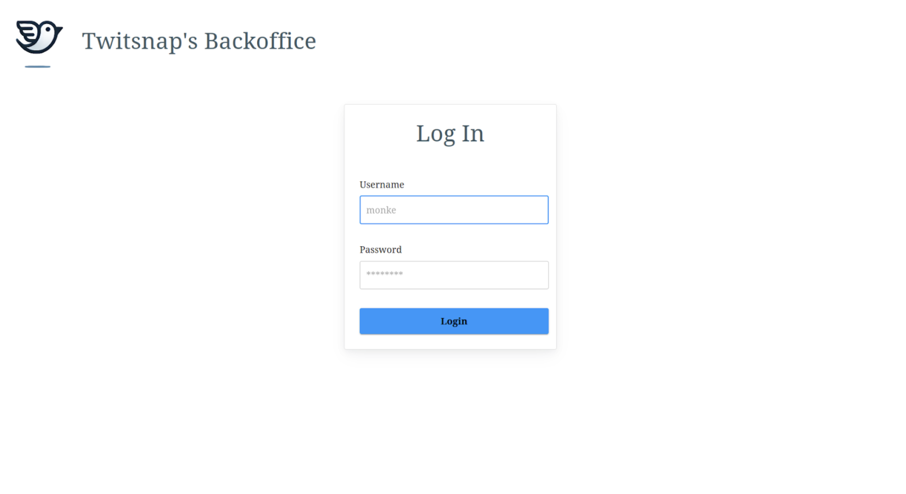

## Navegación
Una vez dentro de la plataforma, verás un cartel de bienvenida que describe las diferentes opciones disponibles. En la barra de navegación, ubicada en el lado izquierdo de la pantalla, encontrarás las distintas secciones. Haz clic en una opción para navegar hacia ella. A continuación, te explicamos qué encontrarás en cada sección:

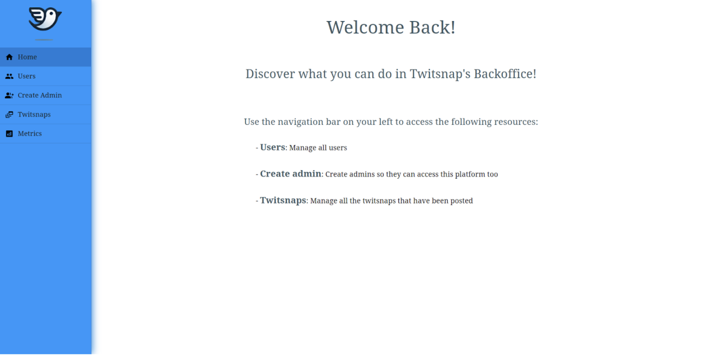

### Users
En la pestaña **Users** puedes ver una lista de todos los usuarios registrados en la plataforma.

- **Opciones de visualización:**
  En la parte inferior derecha del recuadro, puedes seleccionar cuántos usuarios quieres ver por página y cambiar entre las páginas disponibles.

- **Ordenación y filtrado:**
  Puedes ordenar y filtrar la lista por cualquiera de las columnas, simplemente haciendo clic en el título de la columna deseada.

- **Visualización de detalles:**
  Haz clic en el botón Visualizar (en la última columna de cada fila) para acceder a los datos específicos de un usuario.

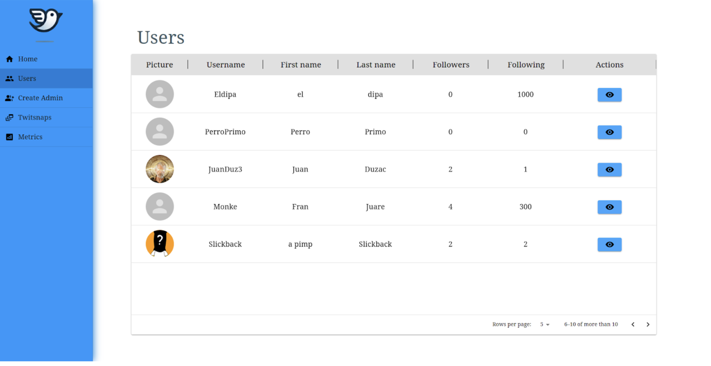

Además de visualizar los datos, podrás bloquear o desbloquear al usuario seleccionado si eres administrador.

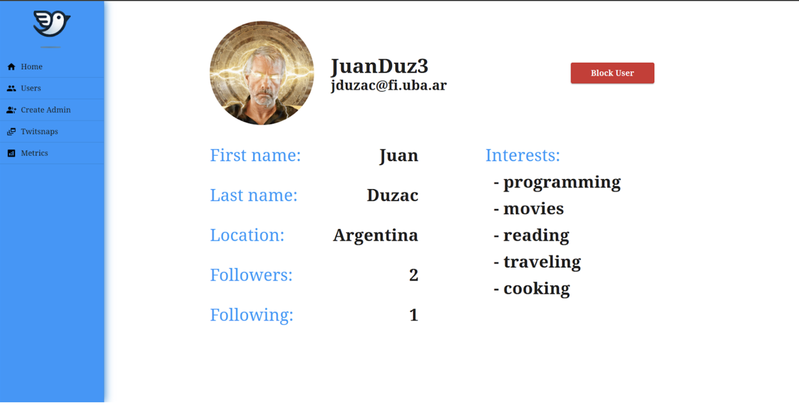

### Create Admin
En la pestaña **Create Admin**, puedes crear nuevas cuentas de administrador con las credenciales que desees.

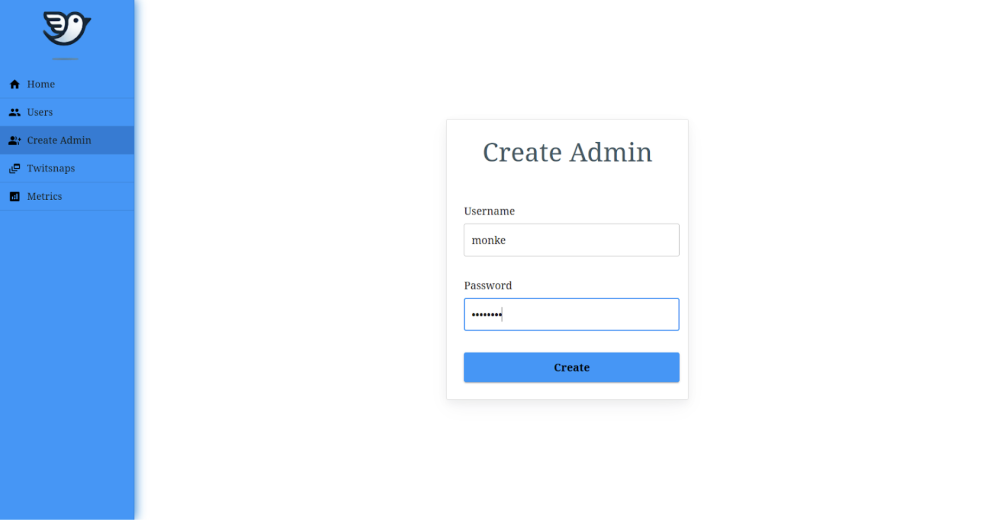

> **Nota:** No es posible crear dos administradores con el mismo username, por lo que deberás asegurarte de elegir un nombre único.

### Twitsnaps
En la sección **Twitsnaps** encontrarás una lista similar a la de usuarios, pero mostrando una previsualización de todos los twitsnaps registrados en el sistema.

- **Visualización de detalles:**
  Al igual que en la sección de usuarios, al hacer clic en el botón Visualizar, podrás ver la información completa de un twitsnap específico.

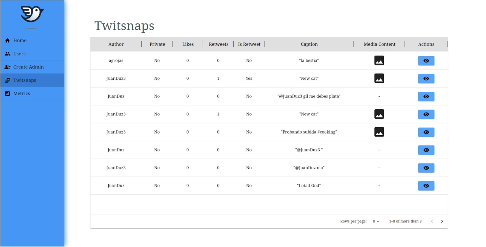

Al igual que en los Users, al clickear en la acción de visualizar podremos ver la información más específica del twitsnap elegido:

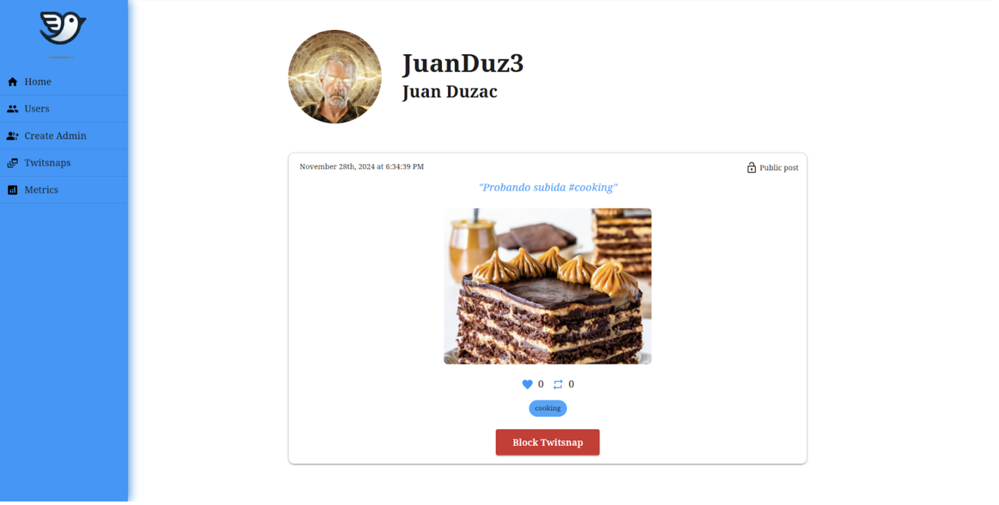

### Métricas
En la pestaña **Metrics**, puedes consultar diversas estadísticas relacionadas con el funcionamiento de la plataforma. Estas se dividen en las siguientes secciones:

- **Registration:** Muestra métricas sobre los registros de usuarios, incluyendo la tasa de éxito y la distribución de los métodos de registro.

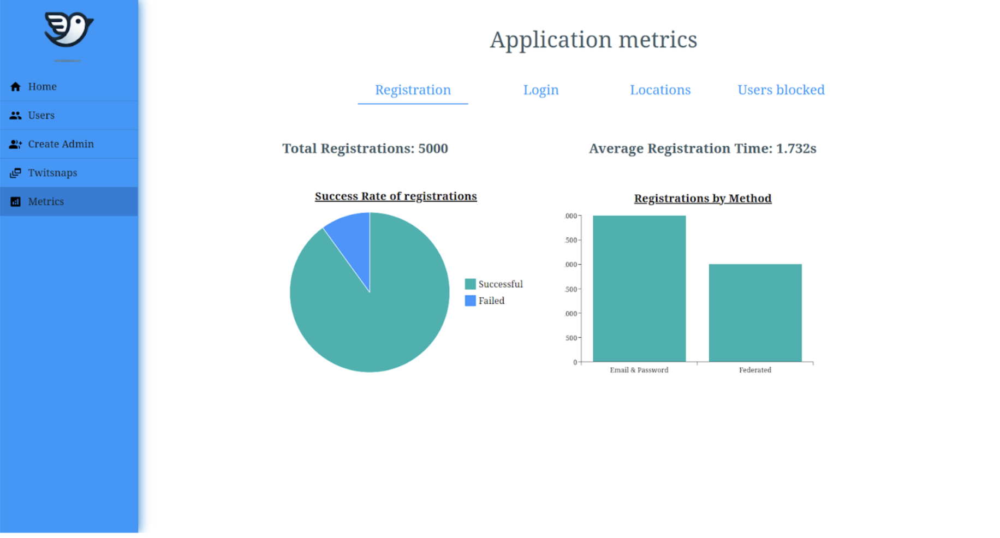

- **Login:** Incluye estadísticas sobre los inicios de sesión, como el número total, la tasa de éxito y la distribución de métodos utilizados.

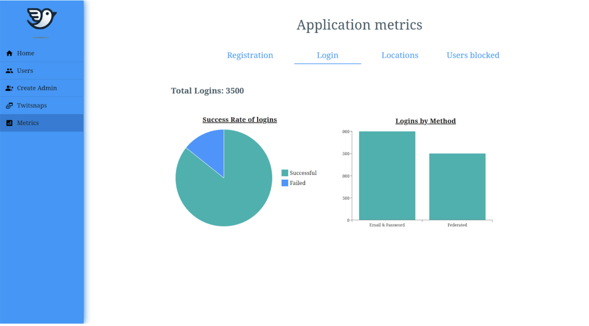

- **Locations:** Presenta un desglose de los usuarios por ubicación geográfica (país).

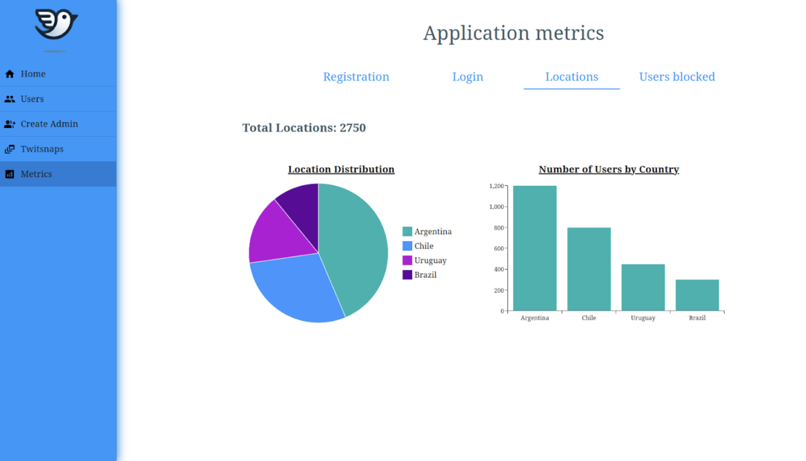

- **Users blocked:** Proporciona información sobre los bloqueos de usuarios, incluyendo: la cantidad bloqueados que hubo, cuántos hay actualmente, el tiempo promedio de bloqueo y las razones.

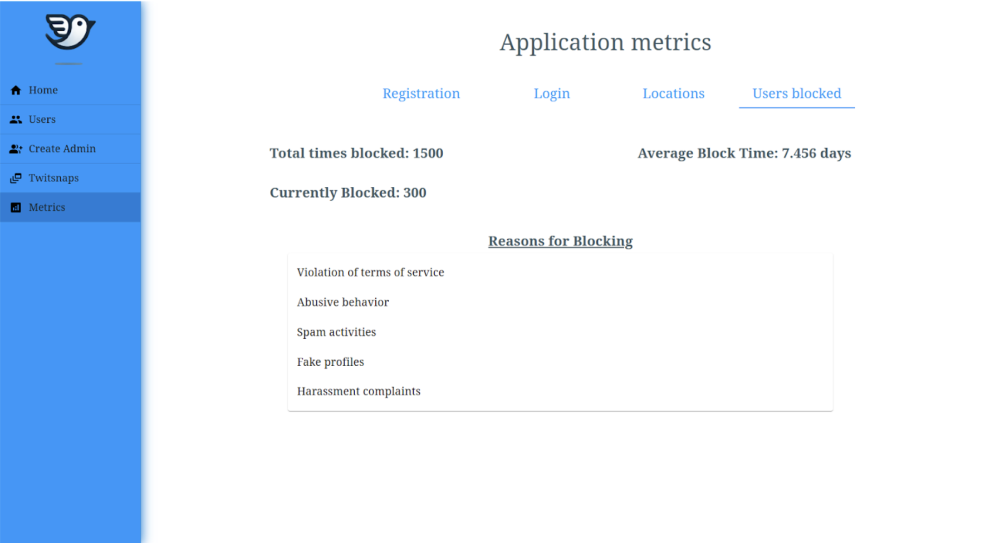
